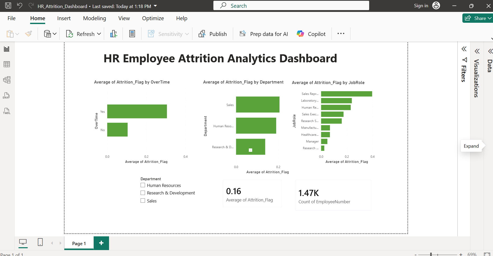

# HR Employee Attrition Analytics Dashboard
### Tools: Python · SQL · Power BI

---

## Project Overview
Analyzed IBM HR dataset to identify key factors driving employee attrition.
Built an interactive Power BI dashboard to help HR teams track workforce KPIs and take data-driven retention decisions.

---

## 📊 Dashboard Preview

---

## 🔍 Key Findings
- Overall attrition rate: **16.1%** (237 out of 1,470 employees)
- Employees who work **overtime** have 3x higher attrition rate than those who don't
- **Sales Representatives** have the highest attrition rate among all job roles (~40%)
- **Research & Development** department has the lowest attrition rate
- Employees with **low monthly income** are significantly more likely to leave

---

## 📁 Files in this Repository
| File | Description |
|------|-------------|
| `HR_Attrition_Analysis.ipynb` | Python EDA + Random Forest model (Google Colab) |
| `HR_Attrition_PowerBI.csv` | Clean dataset used for Power BI dashboard |
| `HR_Attrition_Dashboard.pbix` | Power BI dashboard file |
| `dashboard_screenshot.png` | Dashboard preview image |

---

## ⚙️ How I Built This

### Step 1 — Python EDA (Google Colab)
- Loaded IBM HR dataset (1,470 records, 35 features)
- Performed exploratory data analysis using Pandas, Matplotlib, Seaborn
- Built correlation heatmap to find attrition drivers
- Trained Random Forest classifier — achieved **88.1% accuracy**
- Exported clean CSV for Power BI

### Step 2 — Power BI Dashboard
Built 5 interactive visuals:
- **KPI Card** — Overall attrition rate (16%)
- **KPI Card** — Total employees (1,470)
- **Bar Chart** — Attrition rate by Department
- **Bar Chart** — Overtime vs Attrition impact
- **Bar Chart** — Attrition rate by Job Role
- **Slicer** — Department filter (filters all visuals)

---

## 🛠️ Tools & Technologies
- **Python** — Pandas, NumPy, Matplotlib, Seaborn, Scikit-learn
- **Power BI Desktop** — Interactive dashboard
- **Google Colab** — Development environment
- **Dataset** — IBM HR Analytics (Kaggle)

---

## 📈 Model Results
| Metric | Score |
|--------|-------|
| Accuracy | 88.1% |
| Dataset size | 1,470 records |
| Features used | 35 |
| Algorithm | Random Forest |

---

## 👩‍💻 Author
**Y. Venkata Siva Deepika**
- GitHub: [github.com/VenkataSivaDeepika](https://github.com/VenkataSivaDeepika)
- LinkedIn: [linkedin.com/in/venkata-siva-deepika](https://linkedin.com/in/venkata-siva-deepika)
